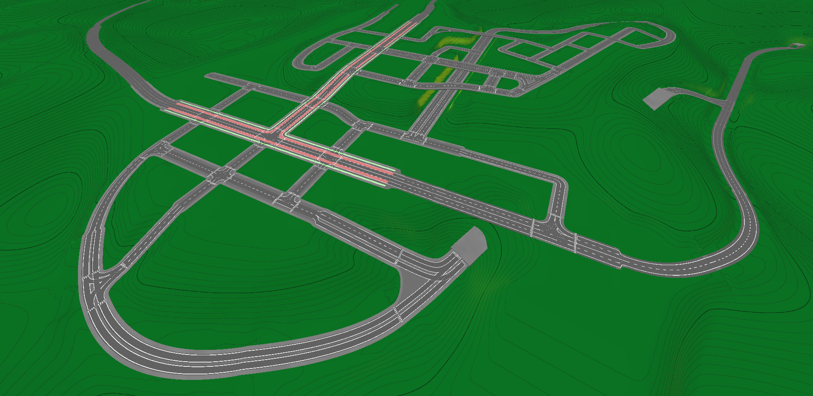
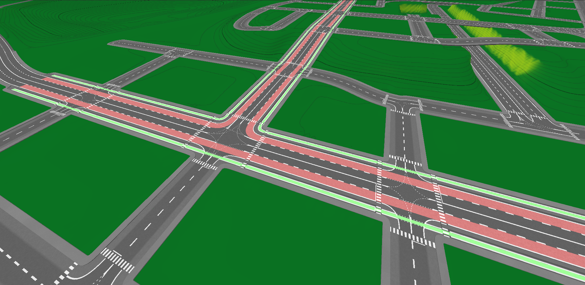
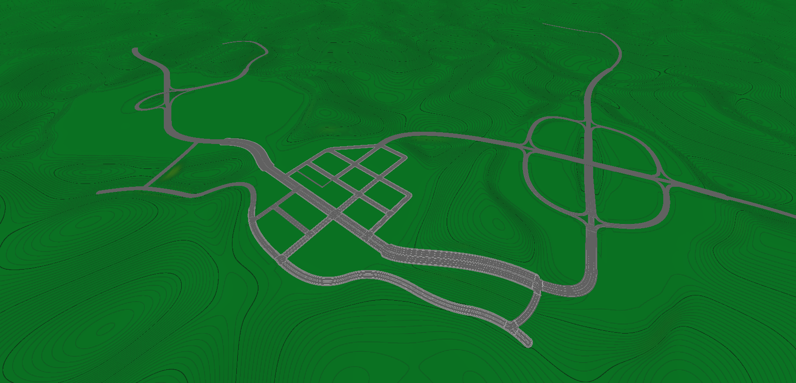
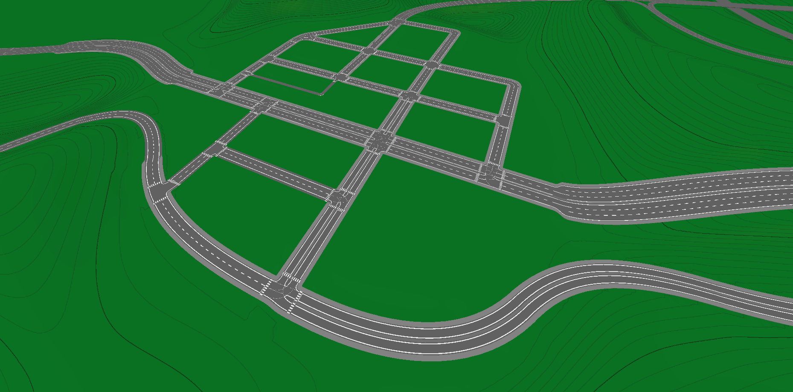
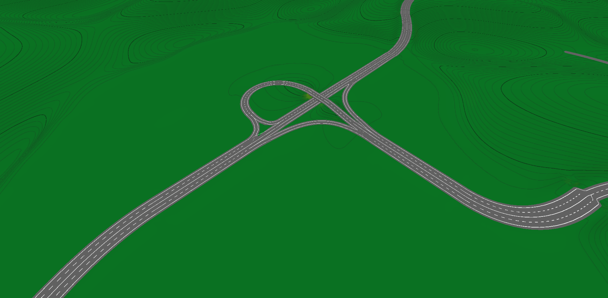
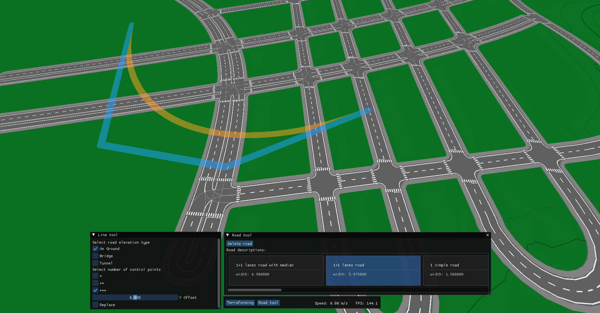
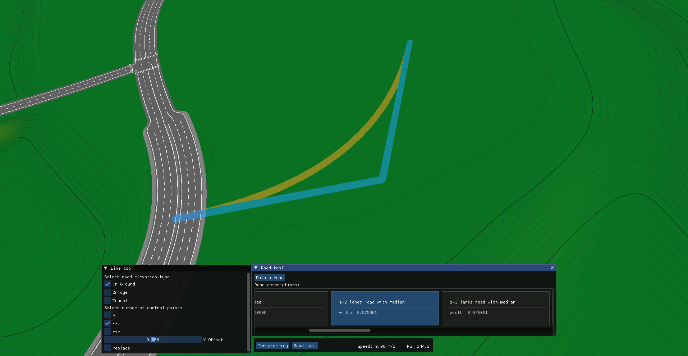
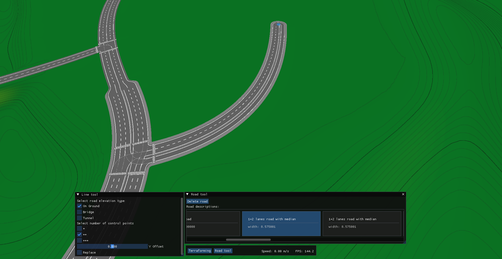
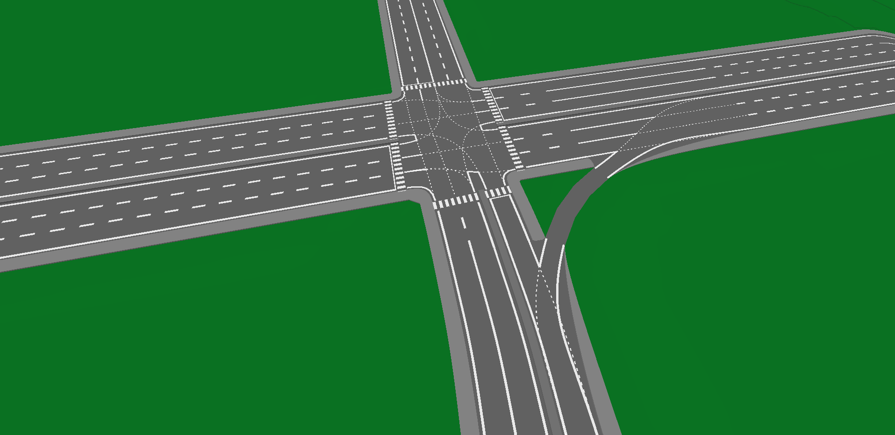

Showcase of YetAnotherTown, a work-in-progress Real-Time Traffic Simulation Engine. In its current form, the project features a functional terraforming and road-building system. This repository contains some images of the project; no code or demo is available yet, as the project is still in an early stage.

Current features:
    1. Expandable multithreaded architecture: Currently, one thread handles rendering and memory management, one handles the road network, terrain maintenance, and geometry operations, and one is reserved for future traffic simulation.
    2. LOD-based terrain rendering: Terrain chunks are drawn at lower resolution depending on their distance from the camera.
    3. Terraforming tools: Flattening, smoothing, raising, and sloping.
    4. Cubic Bézier–based road drawing: Draw a cubic Bézier curve, and the system automatically integrates it into the current road network; new intersections and geometry are computed accordingly.

Some images:

